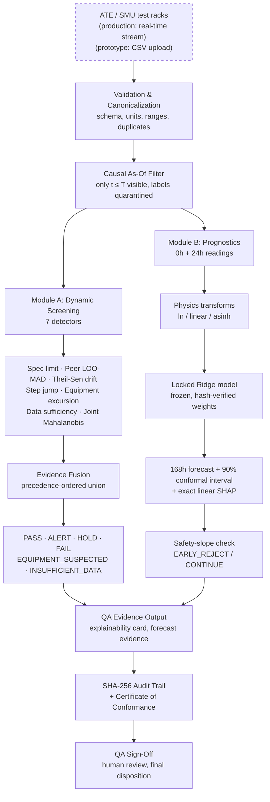

# SIH26170 // Spacecraft Component Screening & Prognostics Workstation (SCREENX)
## AI-Driven Dynamic Outlier Detection & 168-Hour Degradation Forecasting

**Problem Statement ID:** 26170
**Sector:** Spaceflight Semiconductor Quality Assurance & Mission Assurance
**Agency / Division:** ISRO / URSC — Component Qualification & Screening Division (CQSD)
**Governing Standards:** MIL-PRF-19500/703 Table I • MIL-STD-750 Method 1038/1042 (HTRB/HTGB)
**Target Hardware:** Space-Grade Rad-Hard N-Channel Power MOSFETs (IRHNJ57130, 100V, 22A, 180mΩ)
**System Classification:** Operational QA Workstation Prototype

**Verification Status:** **439 / 439 Verification Tests Passing** (full suite, ~24s — see Section 9 for the reproduction command)

### Links
| Resource | Link |
|---|---|
| **Live Deployed Demo** | https://screenx-stmu.onrender.com/ |
| **Demo Video (YouTube)** | https://youtu.be/cEKgM_9rbWA |
| **Evaluation / Benchmark Notebook (Colab)** | https://colab.research.google.com/drive/1hg_cDXeVBwwVIg1Ls-MKfIhFKuMUfBgC?usp=sharing |

---

## Table of Contents
1. [Executive Summary & Problem Statement](#1-executive-summary--problem-statement)
2. [Component Physics & Electrical Failure Mechanisms](#2-component-physics--electrical-failure-mechanisms)
3. [System Architecture & Data Governance](#3-system-architecture--data-governance)
4. [Module A: Dynamic Multi-Detector Screening Engine](#4-module-a-dynamic-multi-detector-screening-engine)
5. [Module B: Prognostics, Uncertainty & Safety-Slope](#5-module-b-prognostics-uncertainty--safety-slope)
6. [Workstation Operations & User Manual](#6-workstation-operations--user-manual)
7. [REST API Specification](#7-rest-api-specification)
8. [Empirical Evaluation & Benchmark Verification](#8-empirical-evaluation--benchmark-verification)
9. [Deployment & Operations Guide](#9-deployment--operations-guide)
10. [Integration with Existing ISRO Infrastructure](#10-integration-with-existing-isro-infrastructure)
11. [Known Limitations](#11-known-limitations)
12. [Audit Trail & Compliance Artifacts](#12-audit-trail--compliance-artifacts)

---

## 1. Executive Summary & Problem Statement

In space missions, electronic components undergo environmental stress screening (ESS), including 168 hours of High-Temperature Reverse Bias (HTRB) burn-in at **150.0°C** and **80V bias** under MIL-STD-750 Method 1038 to precipitate infant mortality and latent physical defects before spacecraft payload integration.

### The Fatal Flaw of Static End-of-Line Limits
Traditional Automated Test Equipment (ATE) applies static pass/fail limit gates at terminal checkout (168 hours):
- **The Scenario:** In a homogeneous wafer lot where healthy components read drain leakage ($I_{\text{DSS}}$) of $\approx 10.0\,\mu\text{A}$, an anomalous part drifts from $10.0\,\mu\text{A} \to 45.0\,\mu\text{A}$ (a 350% degradation). Because the datasheet ceiling is $50.0\,\mu\text{A}$, traditional ATE passes the component.
- **Flight Risk:** In orbit, latent defects accelerate under radiation and thermal-vacuum conditions, triggering catastrophic satellite payload outages.

### The SIH26170 Unified Platform
This software system unifies two complementary, mathematically rigorous mission-assurance subsystems:
1. **Module A (Dynamic Multi-Detector Screening Engine):** Evaluates multi-checkpoint readouts ($0, 24, 48, 72, 96, 120, 144, 168\,\text{h}$) across statistical and physical detectors, combining peer-lot outliers, drift kinetics, step jumps, chamber excursion discrimination, and joint multi-parameter anomaly scoring.
2. **Module B (Time-Series Prognostics & Safety-Slope Layer):** Uses early readouts ($0\,\text{h}$ and $24\,\text{h}$) to forecast terminal 168-hour values using locked L2-Ridge Regression with 90% Conformal Prediction Intervals and exact closed-form SHAP feature attributions, and computes the exact Problem Statement Safety Slope to authorize early extraction at 24 hours.

```
       RAW TELEMETRY                MODULE A: SCREENING                     MODULE B: PREDICTION                   WORKSTATION UI
 +-----------------------+       +------------------------+              +------------------------+          +-------------------------+
 | Multi-checkpoint CSV  |  ==>  | 7 Statistical & Phys.  |  ==========> | Locked Ridge (λ=1.0)   |  =====>  | 1. Choose/Upload Data   |
 | [0h, 24h, 96h, 168h]  |       | Detectors (Spec, Peer, | (Fused State)| 168h Forecast &        |          | 2. Dynamic Screening    |
 | IDSS, VGS(th), RDS,   |       | Drift, Step, Eq, Suff, |              | 90% Conformal Interval |          | 3. Prediction Bay       |
 | IGSS Long Format Data |       | Joint)                 |              | Exact Linear SHAP Bars |          | 4. Traceability & CoC   |
 +-----------------------+       +------------------------+              +------------------------+          +-------------------------+
                                             ||                                      ||
                                   +--------------------+                  +--------------------+
                                   | Evidence Fusion    |                  | Safety-Slope &     |
                                   | Engine (6 States:  |                  | Early Rejection    |
                                   | PASS/ALERT/HOLD/   |                  +--------------------+
                                   | FAIL/EQ/INSUFF)    |
                                   +--------------------+
                                             ||
                                             +==================+====================+
                                                                \/
                                                  +----------------------------+
                                                  | Cryptographic Audit Trail  |
                                                  | SHA-256 Telemetry Digest   |
                                                  +----------------------------+
```

---

## 2. Component Physics & Electrical Failure Mechanisms

The platform monitors the four core electrical parameters defining power MOSFET degradation under HTRB stress:

| Parameter | Unit | Physical Mechanism | MIL-PRF-19500 Limits | Modeling Coordinate Space |
| :--- | :---: | :--- | :---: | :---: |
| **$I_{\text{DSS}}$** (Drain Leakage) | $\mu\text{A}$ | Thermal oxide breakdown, sub-surface punch-through | $\le 50.0\,\mu\text{A}$ | Positive Log Domain: $u = \ln(y)$ |
| **$V_{\text{GS(th)}}$** (Threshold Voltage) | $\text{V}$ | Oxide-trapped charge, interface trap buildup | $[2.0\,\text{V}, 4.0\,\text{V}]$ | Linear Space: $u = y$ |
| **$R_{\text{DS(on)}}$** (On-Resistance) | $\text{m}\Omega$ | Channel metallization electromigration, die-attach voiding | $\le 180.0\,\text{m}\Omega$ | Positive Log Domain: $u = \ln(y)$ |
| **$I_{\text{GSS}}$** (Gate Leakage) | $\text{nA}$ | Gate dielectric micro-rupture, Fowler-Nordheim tunneling | $[-100.0\,\text{nA}, +100.0\,\text{nA}]$ | Signed Hyperbolic Arcsine: $u = \text{asinh}(y / 1.0\,\text{nA})$ |

*Physics Rationale on $I_{\text{GSS}}$:* Gate leakage can be positive or negative depending on gate-source bias polarity. Taking absolute value or log destroys the underlying sign physics. The signed hyperbolic arcsine representation preserves zero-crossing linearity while compressing extreme excursions.

---

## 3. System Architecture & Data Governance

### System Architecture Flowchart



*Reading the diagram:* data flows one way, from instrument to human sign-off. The model
is locked and never retrained by incoming data, so there is no feedback loop into
Module A or Module B. Retraining is a separate, periodic, offline, QA-approved process
(Section 5E). The dashed first box marks the one prototype-vs-production difference:
the prototype ingests CSV batches, while the proposed deployment streams from the ATE
racks (Section 3, "Current Implementation vs. Proposed Production Architecture").

### Canonical Long-Format Telemetry Schema
All ingested burn-in telemetry must adhere to the standardized schema:
- `component_id`, `lot_id`, `parameter_name`, `elapsed_hours`, `value`, `unit`,
  `temperature_C`, `test_condition`, `instrument_id`, `channel_id`,
  `measurement_quality`, `rework_count`.

### Strict Ground-Truth Quarantine
Downstream machine learning models and feature extractors are structurally blocked from viewing evaluation labels (`trajectory_class`, `abnormal_by_24h`, etc.). Any attempt to read quarantined columns triggers an immediate runtime exception (`assert_ground_truth_quarantine`).

### Causal As-Of Temporal Boundary
$$V_T = \sigma_{t \le T}(D), \quad t = \text{elapsed hours}$$
When an inspector assesses a component at $T = 24\,\text{h}$, the software physically removes any data with $t > 24\,\text{h}$ before any module runs.

### Current Implementation vs. Proposed Production Architecture

**This is an important distinction, and it is stated explicitly here rather than
implied:**

The present system (this repository and the deployed demo) implements and validates
the full detection and prediction pipeline — Module A, Module B, fusion logic, and
audit trail — using **batch CSV ingestion** as the data-entry point. A dataset is
uploaded or selected, and the full pipeline runs against it. This validates the core
screening and prognostic logic end-to-end, independent of how the data physically
arrives.

**In the proposed production deployment, this ingestion layer is replaced by direct
real-time streaming** from ATE/SMU test racks over SCPI, TCP/IP, or serial, as burn-in
testing runs — components are screened continuously as each checkpoint reading becomes
available, rather than in a single batch upload after the fact. The canonical schema,
the causal as-of enforcement, and the downstream detectors and prediction model are
**identical** in both cases; only the ingestion mechanism changes. This is a systems
integration step, not a redesign of the detection or prediction logic, which is already
built and benchmarked.

---

## 4. Module A: Dynamic Multi-Detector Screening Engine

Module A evaluates component readouts across multiple stress checkpoints using **seven independent detectors** (six core statistical/physical detectors, plus one multivariate backstop):

#### 1. Detector A ($D_{\text{spec}}$) — Specification Hard Limit Gate
Hard veto against MIL-PRF-19500 Table I bounds. Cannot be overridden by any statistical model.

#### 2. Detector B ($D_{\text{peer}}$) — Robust Peer Lot-Relative Outlier
$$b_i = \frac{y_i - \tilde{\mu}_{-i}}{1.4826 \cdot \text{MAD}_{-i} + \epsilon}$$
Leave-One-Out cohort median/MAD. $|b_i| \ge 15.0 \to$ `MAJOR_OUTLIER` (immediate reject).

#### 3. Detector C ($D_{\text{drift}}$) — Non-Parametric Temporal Drift
Theil-Sen median slope estimator; excess drift $g_{\text{excess}}$ normalized against lot baseline. Statuses: `STABLE`, `MODERATE_DRIFT`, `EXCESSIVE_DRIFT`, `ACCELERATING`.

#### 4. Detector D ($D_{\text{step}}$) — Abrupt Step-Jump Detector
$$J(T) = \frac{|y(T) - y(T_{\text{prev}})|}{\sigma_0} \ge 4.0$$
A jump at or above this ratio raises `ABRUPT_JUMP_ALERT`.

#### 5. Detector E ($D_{\text{eq}}$) — Chamber & Equipment Excursion Discriminator
Flags common-mode ATE/chamber drift (ANOVA $p<0.01$) to prevent false condemnation of healthy hardware sharing a faulty fixture channel.

#### 6. Detector F ($D_{\text{suff}}$) — Data Sufficiency Policy
If lot size $N < 8$, peer scoring is suppressed rather than generating statistically under-powered false alarms.

#### 7. Detector G ($D_{\text{joint}}$) — Multivariate Joint Anomaly Backstop
A backstop for compound degradation that no single-parameter detector catches. For each
component, it builds a 4-dimensional vector across all parameters in transform space and
computes a leave-one-out, shrinkage-regularized Mahalanobis distance against the lot:

$$\mathbf{R}_{\text{shrunk}} = (1-\alpha)\,\mathbf{R}_{\text{sample}} + \alpha\,\mathbf{I}, \quad \alpha = 0.20$$

- **Threshold:** $D_{\text{crit}} = 4.25$. Since $D^2 \sim \chi^2_4$ for four parameters,
  $D^2 = 18.0625$ corresponds to an upper-tail probability of about 0.12% (closed form:
  $P(\chi^2_4 > x) = e^{-x/2}(1 + x/2)$).
- **Action:** components above threshold escalate to `HOLD` with reason
  `JOINT_MAHALANOBIS_EXCESS`, even when no individual parameter crosses its own
  detector's threshold.
- **Dependencies:** implemented with NumPy and pandas only. No scikit-learn, SciPy, or
  other ML framework is used in the detection logic.
- **Differentiation test:** `tests/screening/test_joint_detector.py` injects a
  correlated 1.9σ shift on all four parameters. Every univariate detector stays quiet
  (all peer $|z| < 3.0$, all drift $|g| < 2.5$, every parameter individually `PASS`),
  yet $D_{\text{joint}} = 5.02 > 4.25$ and the component escalates to `HOLD`.
- **Benchmark contingency** (398-component frozen benchmark, $D_{\text{crit}} = 4.25$):

| Checkpoint | TP | FP | FN | TN | Precision | Recall |
| :---: | :---: | :---: | :---: | :---: | :---: | :---: |
| 24h | 2 | 1 | 56 | 331 | 66.7% | 3.4% |
| 96h | 8 | 4 | 49 | 322 | 66.7% | 14.0% |

> **How to read this:** $D_{\text{joint}}$ is a high-precision, low-recall backstop. It is
> deliberately conservative and adds a narrow set of catches on top of the other six
> detectors. It is not a primary detector, and its recall should not be read as the
> system's overall recall (see the union recall table in Section 8).

### Evidence Fusion Precedence Hierarchy

| Precedence | Condition | Resulting State | Disposition Qualifier |
| :---: | :--- | :---: | :--- |
| **Level 1** | Absolute specification breach ($D_{\text{spec}}$) | **`FAIL`** | `SPECIFICATION_FAILURE` |
| **Level 2** | Missing readouts / Lot size $N < 8$ | **`INSUFFICIENT_DATA`** | `INSUFFICIENT_EVIDENCE` |
| **Level 3** | Chamber excursion with excess drift | **`FAIL` / `ALERT`** | `COMPONENT_DEGRADATION_CONFOUNDED_BY_EQUIPMENT` |
| **Level 3** | Chamber excursion without excess drift | **`EQUIPMENT_SUSPECTED`** | `EQUIPMENT_ONLY` |
| **Level 4** | Autonomous accelerating drift or step jump | **`FAIL`** | `COMPONENT_DEGRADATION` |
| **Level 4a** | Screening margin breach with subtle drift | **`HOLD`** | `HOLD_SCREENING_MARGIN` / `HOLD_FOR_RETEST` |
| **Level 4b** | Joint multivariate anomaly, no single-parameter trigger | **`HOLD`** | `JOINT_MAHALANOBIS_EXCESS` |
| **Level 5** | Major peer outlier without active drift | **`ALERT`** | `PEER_OUTLIER_STATIONARY` |
| **Level 5** | Stationary, compliant, homogeneous | **`PASS`** | `NOMINAL_STABLE` |

All precedence levels are evaluated as a **union (OR)** — any single detector firing is
sufficient to escalate past `PASS`; no two detectors are ever required to agree.

---

## 5. Module B: Prognostics, Uncertainty & Safety-Slope

### A. Machine Learning Model Formulation
L2-Regularized Ridge Regression ($\lambda = 1.0$), inputs $x = [v_0, v_{24}]^T$, target $v_{168h}$. Pre-calibrated on 1,000 components across 50 calibration lots. No runtime refitting. Weights stored as exact IEEE-754 hex, verified bit-for-bit against manifest SHA-256 `bde6989e24d195ab4b53f93c46c2156d1c336fe820baf149d76d32943e135667`.

### B. Uncertainty Quantification (90% Split-Conformal Intervals)
$$\hat{y}_{168\text{h}}^{\text{low/high}} = \mathcal{T}^{-1}(u_{\text{pred}} \mp 1.64485 \cdot \sigma_{\text{eff}})$$

### C. Safety-Slope & Early Rejection Decision Layer
$$\text{predicted drift rate} = \frac{\hat{y}_{168h} - y_{24h}}{144}, \quad \text{safety slope} = \frac{S_{\text{thresh}} - y_{24h}}{144}$$
$$\text{predicted drift rate} > \text{safety slope} \iff \hat{y}_{168h} > S_{\text{thresh}}$$
Outputs: `EARLY_REJECT`, `CONTINUE`, or `INSUFFICIENT_DATA`.

### D. Exact Linear Ridge SHAP Attribution
$$\phi_{\text{base}} = (\beta_1+\beta_2)(u_0-\bar{u}_0), \quad \phi_{\text{slope}} = \beta_2(u_{24}-u_0), \quad \phi_0+\phi_{\text{base}}+\phi_{\text{slope}} = \hat{u}$$
Here $\phi_{\text{base}}$ is the `baseline_0h` attribution and $\phi_{\text{slope}}$ is the `slope_0_24` attribution shown in the UI.
Exact to machine precision — decomposes forecast into initial device offset vs. kinetic drift, with zero sampling variance (unlike Monte Carlo SHAP approximations).

### E. Model Governance & Retraining Policy
The production model is frozen: locked weights, used identically across every
prediction until formally superseded. There is no online learning. Updates occur only
through a periodic, offline, human-validated retraining cycle, approved by a QA
engineer before deployment of any new locked model version — deliberately, because the
true 168h outcome is unknown until 168h have elapsed (label delay), a false negative is
categorically more costly than conservative retraining (asymmetric failure cost), and
every deployed model version must remain hash-locked and independently auditable
(traceability).

---

## 6. Workstation Operations & User Manual

```
[ 1. Ingest Dataset ] ──> [ 2. Dynamic Screening ] ──> [ 3. Prediction ] ──> [ 4. Traceability & CoC ]
```

1. **Ingest:** Pre-loaded Phase 4B dataset (100 lots, 2,000 components) or drag-and-drop CSV with 11-point schema validation.
2. **Screening:** Disposition badge, 20-socket interactive tray matrix, measured parameters table, 4-stack SVG trend plots, detector evidence table, QA explainability card.
3. **Prediction:** Locked Ridge forecast table, conformal uncertainty inspector, SHAP attribution bars, safety-slope gauges and arithmetic breakdown.
4. **Traceability & CoC:** Cryptographic lineage hashes, printable Certificate of Conformance with QA Inspector / R&QA Concurrence / Disposition Authority sign-off blocks, forensic ASCII/JSON export.

---

## 7. REST API Specification

| Endpoint | Method | Description |
| :--- | :---: | :--- |
| `/health` | `GET` | System health and model lock verification |
| `/model_lineage` | `GET` | Immutable model weights and manifest hash |
| `/lots`, `/lots/{lot_id}/components` | `GET` | Lot and component listing |
| `/components/{id}/pipeline?as_of=T` | `GET` | Complete unified result |
| `/components/{id}/screening?as_of=T` | `GET` | Module A results |
| `/components/{id}/forecast?as_of=T` | `GET` | Module B forecast + interval |
| `/components/{id}/safety?as_of=T` | `GET` | Safety-slope & early-rejection decision |
| `/components/{id}/explainability?as_of=T` | `GET` | Explainability card (detector evidence, SHAP, plain-language justification) |
| `/components/{id}/audit?as_of=T` | `GET` | SHA-256 audit record and lineage |

---

## 8. Empirical Evaluation & Benchmark Verification

| Evaluation Dimension | Population | Result |
| :--- | :---: | :---: |
| Automated Verification Suite | 439 Tests | **100% Pass (439/439)** |
| Module A Cumulative Union Recall | 25 Defective Parts (of 398 benchmark) | **88.00% (22 / 25)** |
| Module A Equipment Precision | 398 Components | **100.00% (30 / 30)** |
| Module A Healthy-Part Acceptance | 398 Components | **95.18% (158/166 nominal stable)** |
| Module B 168h Forecast MAE | 500 Unseen Parts / 25 Lots | IDSS 0.057 µA · VGS(th) 0.024 V · RDS(on) 0.70 mΩ · IGSS 0.71 nA |
| Module B vs. Linear Baseline | 500 Unseen Parts / 25 Lots | **>80% error reduction, all parameters** |
| Module B 90% Interval Coverage | 500 Unseen Parts / 25 Lots | 84.2% – 90.0% |
| Real-Data External Validation | UCI SECOM, 1,567 wafers (CC BY 4.0) | **4.52× enrichment lift** (30.0% precision, top-20, vs. 6.64% base rate) |

*Benchmarked on synthetic data (398/500-component sets) unless noted; SECOM validation
uses real public semiconductor fab data.*

### Module A Union Recall by Defect Mechanism

| Defect Mechanism | Total | Detected | Recall |
| :--- | :---: | :---: | :---: |
| Accelerating Exponential Drift | 3 | 3/3 | 100% |
| Static Specification Breach | 6 | 6/6 | 100% |
| Mixed Compound Degradation | 2 | 2/2 | 100% |
| Lot Cohort Outlier | 1 | 1/1 | 100% |
| Linear Temporal Drift | 10 | 8/10 | 80% |
| Subtle Low-Amplitude Step Jump | 1 | 0/1 | 0% |
| **Overall Union** | **25** | **22/25** | **88.00%** |

### Cryptographic Manifest Hashes
- Model Manifest SHA-256: `bde6989e24d195ab4b53f93c46c2156d1c336fe820baf149d76d32943e135667`
- Results SHA-256: `9a608bb46f87913641182f49139a6d67e5d8b2c39b7422c3cc30c61f3a85a4b4`
- Observations Telemetry SHA-256: `b5de6a03022a9350b6f304b9af593768e7f83a8fc61fde6ca98e690cfa1f275f`
- Benchmark Telemetry SHA-256: `6e680a6b7d14fe83f98219c670a41fdf74a0bb2367d30ca5df8b0ba995b0586e`

---

## 9. Deployment & Operations Guide

### A. Reproducibility — "Can I run your tests right now?"
```bash
pytest                                    # full automated suite
python benchmarks/secom_validation.py     # real-data external benchmark
```

### B. Local Execution
```bash
PYTHONPATH=src python3 src/sih26170/service/server.py --host 0.0.0.0 --port 8000
```

### C. Docker
```bash
docker build -t sih26170_workstation .
docker run -d -p 8000:8000 --name sih26170_workstation sih26170_workstation
# or: docker compose up -d
```

### D. Cloud Deployment (Render) — primary live demo
Live at **https://screenx-stmu.onrender.com/**. The application binds to `0.0.0.0` and
reads `PORT` from the environment to comply with Render's dynamic port assignment.
Free-tier instances sleep after inactivity; allow ~60–90s for cold start if the demo
hasn't been visited recently.

---

## 10. Integration with Existing ISRO Infrastructure

This system is designed to integrate alongside existing test and quality
infrastructure, not replace it:

- **Data source:** ingests from ATE/SMU racks via standard instrument interfaces
  (SCPI/TCP-IP/serial) in the proposed production architecture — no change to lab
  hardware required. (See Section 3 for the prototype-vs-production ingestion
  distinction.)
- **Quality records:** the generated Certificate of Conformance and SHA-256 audit
  trail are structured for export (JSON/PDF) into existing LIMS/QA record systems.
- **Approval chain:** sign-off structure (QA Inspector → R&QA Concurrence →
  Disposition Authority) mirrors ISRO's existing MIL-PRF-19500/703 disposition
  process; no new approval workflow is introduced.
- **Deployment environment:** runs as a single containerized service with no external
  web framework dependency, suitable for isolated or air-gapped test-bay networks.

---

## 11. Known Limitations

In the interest of giving QA inspectors and judges an honest account of system
boundaries rather than an unqualified claim of completeness:

| ID | Boundary | Mitigation |
| :--- | :--- | :--- |
| **KL-01** | Two benchmark components with sub-noise-floor linear drift (SNR ≈ 2.089 dB) were not flagged at 24h — the physical movement was smaller than instrument measurement noise. | Addressed via continued screening at later checkpoints (48h/96h) as cumulative drift departs the noise floor. |
| **KL-02** | A component with a sudden onset of degradation after 96h cannot be predicted from 0h/24h data alone — this is a structural limit of early-checkpoint-only prediction, not a model defect. | Intermediate checkpoint screening (96h) catches this population. |
| **KL-03** | Equipment-excursion detection requires a minimum socket-channel sample size to avoid false attribution. | Suppressed below the minimum sample threshold; defaults to conservative individual-component handling. |
| **KL-04** | One IGSS step jump (J=1.14) fell below the abrupt-jump detection threshold (J≥4.0) and was not flagged by that detector specifically. | Gradual-drift detection (Detector C) is the intended backstop for sub-threshold step changes; threshold is set conservatively to avoid mistaking thermal settling transients for genuine damage. |

---

## 12. Audit Trail & Compliance Artifacts
- **Change Audit Log:** `docs/PROTOTYPE_STANDING_LOG.md`
- **Architectural Baseline:** `docs/SIH26170_Architecture.md`
- **Specification Draft & Assumption Matrix:** `docs/SIH26170_Proposed_Solution_Draft.md`
- **Real Semiconductor Benchmark Report:** `docs/SECOM_VALIDATION.md`
